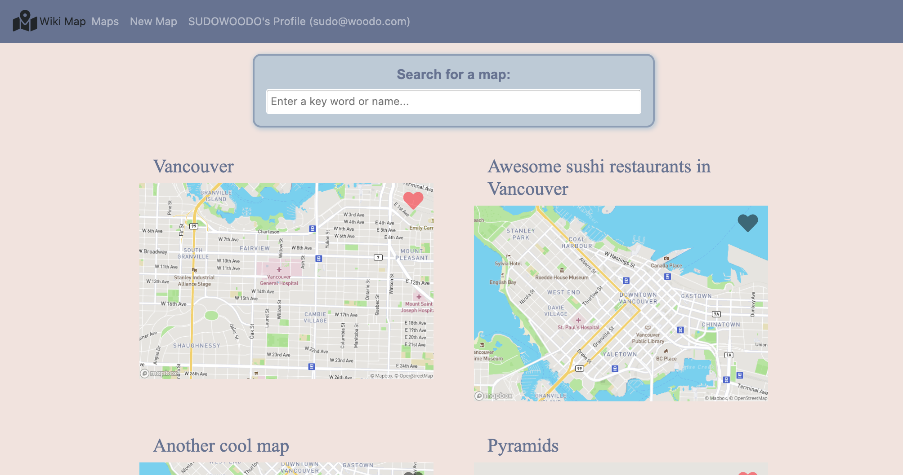

Wiki-maps
=========

A full stack web application that allows users to collaboratively create maps based on a chosen location. Users can then add/remove/edit pins to the created maps to save points of interests. Users can favorite maps to save them to their profile for easier access. 

The web app uses traditional http request/response cycles in some areas but also uses AJAX for features like adding/removing/editing pins

Mapbox APIs was used for its static map preview images and LeafletJs was used for the interactive map feature. Google Autocomplete and Geocoder APIs were also used for smart location searching.

This project was developed for demonstration purposes for the midterm project of Lighthouse Labs Web Development Bootcamp.

Generated from [lighthouse-labs/node-skeleton](https://github.com/lighthouse-labs/node-skeleton)

## Tech Stack

- PostgresSQL
- Node.js
- Express
- EJS
- jQuery
- SASS

## Overview

#### Home page

Users can browse the different maps of different interests that were created collaboratively by other users. They can favorite a map to save them to their profile

#### Making a new map

The interactive map on the right can be dragged around to center the new map on a desired location. Google's Geocoder API is then used to parse the lat/lon coordinates into a readable street address. Conversely, the search box on the left leverages Google's Autocomplete API so that users can directly search for an address, over which the interactive map will automatically center.

#### Adding pins

Other users can contribute to an existing map by highlighting points of interest using pins. Pins can then be edited or deleted as well.

#### User profile

Favorited maps can be found in the user's profile, as well as maps that he/she has contributed to

## Dependencies

- Node 10.x or above
- NPM 5.x or above
- PG 6.x
